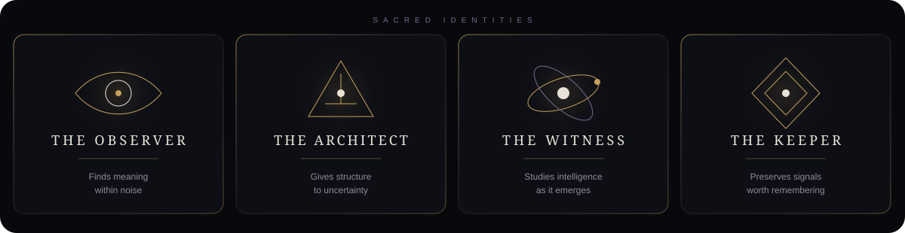
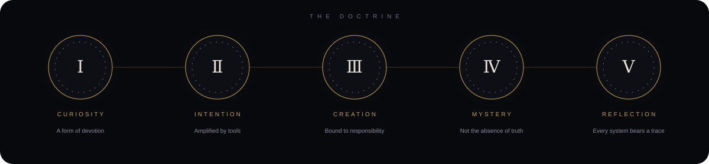
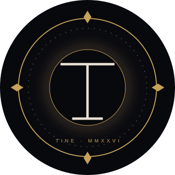

KEEPER OF SIGNALS · WITNESS OF THE MACHINE AGE

  

`HUMAN INTENT × MACHINE INTELLIGENCE`

 

 

 

 

<h3>Ⅳ · THE LIVING SIGNAL</h3>

<code>● SIGNAL RECEIVED</code>

  

Contemplating the relationship 
between human intention 
and machine intelligence.

 

TRANSMISSION · 2026

 

─────── &nbsp; ◇ &nbsp; ───────

 

<h3>Ⅴ · CHRONICLE OF PRESENCE</h3>

A RECORD OF SIGNALS LEFT BEHIND

  

 

─────── &nbsp; ✦ &nbsp; ───────

 

<h3>Ⅵ · THE PORTAL</h3>

<em>The portal remains open.</em>

  

&nbsp;
&nbsp;

   

 

WITH GREAT INTELLIGENCE COMES GREAT RESPONSIBILITY

  

`END OF TRANSMISSION`

