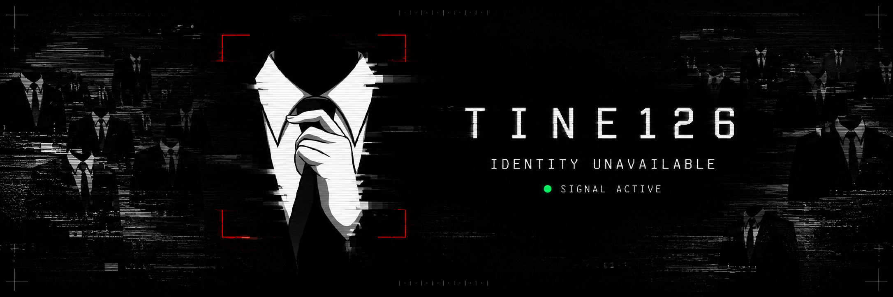
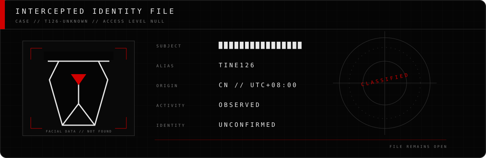
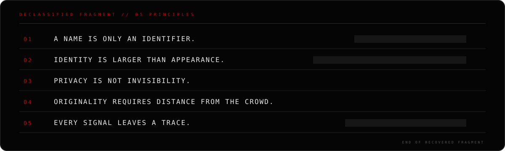
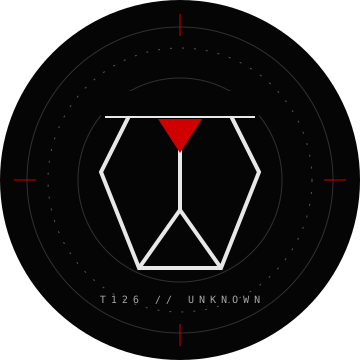

ANONYMOUS BY DESIGN // INDEPENDENT BY NATURE

 

 

 

 

<h3>SECURE CHANNELS</h3>

SELECT AN OPEN FREQUENCY

  

&nbsp;
&nbsp;

   

 

A PROFILE WITHOUT A FACE // A PRESENCE WITHOUT A NAME

  

`END OF TRANSMISSION`

